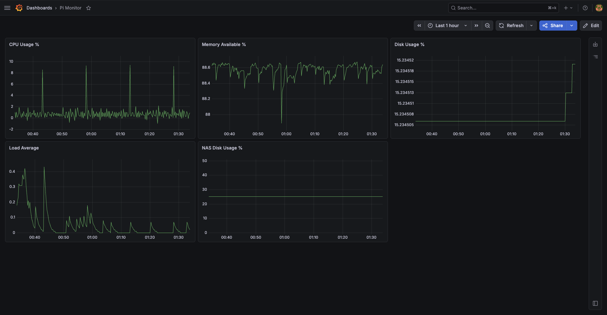

# Pi-NAS

Self-hosted NAS on a Raspberry Pi 4B. Replaces an end-of-life network-attached storage device with a maintainable, documented alternative using commodity hardware and open-source software.

---

## Architecture

```
Computer
  |
  | rsync over SSH (daily, anacron)
  |
Router (ethernet)
  |
Raspberry Pi 4B (Debian Trixie ARM64) — static IP via systemd-networkd
  |
  +-- Powered USB Hub
        |
        +-- NVMe Enclosure --> 1TB NVMe SSD
        +-- NVMe Enclosure --> 1TB NVMe SSD
              |
              mdadm RAID 1
                    |
                    ext4 filesystem
                          |
                          /mnt/nas
                                |
                                FileBrowser Quantum (LAN only)

Internet
  |
Cloudflare Edge (Brisbane/Sydney)
  |
  | Cloudflare Tunnel (outbound, no open ports)
  |
Raspberry Pi 4B
  |
  Nginx → Aersia web player
```

---

## Stack

| Layer | Component | Notes |
|---|---|---|
| OS | Debian Trixie ARM64 | |
| RAID | mdadm RAID 1 (software mirror) | |
| Filesystem | ext4 | |
| File manager | FileBrowser Quantum | LAN only |
| Backup | rsync over SSH via anacron | |
| External access | Cloudflare Tunnel | Replaces port forwarding — ISP-agnostic |
| Metrics | Prometheus + Grafana + Node Exporter | Separate host (Docker Compose) |
| Logs | Grafana Alloy + Loki + Grafana | Alloy on Pi, Loki on separate host |
| Alerting | Grafana alert rules → email | Prometheus + Loki alert rules |
| Service management | systemd | |

---

## Design Decisions

### What was evaluated and rejected

**Raspberry Pi 5** — PCIe NVMe support via HAT eliminates the USB power budget constraint entirely. Ended up not selected because the Pi 4B was already in service and a powered hub resolves the power limitation at lower cost. Pi 5 remains the cleaner hardware choice for a greenfield build.

**OpenMediaVault** — Designed for clean OS installs. Would conflict with existing Nginx, Certbot, and cron configuration already running on the Pi for another project. Rejected in favour of composing individual tools.

**Samba** — Initially considered for Time Machine support. Dropped when Time Machine was dropped; it requires AFP emulation via the `fruit` module and is all-or-nothing. rsync handles the actual backup requirement with less complexity.

**Time Machine** — Cannot be scoped to a single folder. It snapshots the full system state regardless of exclusions. rsync is selective by design.

**Port forwarding + dynamic DNS** — Originally used on previous ISP. Replaced by Cloudflare Tunnel after ISP change to a residential plan that blocks inbound ports 80/443. Tunnel is also more secure — no open inbound ports, no dynamic DNS maintenance, ISP-agnostic.

**WireGuard VPN** — The correct long-term solution for remote access, but deferred. One-time setup cost, near-zero maintenance after.

**Filebrowser (original)** — v2.63.4 has an unresolved routing bug (`e.params.catchAll is not iterable`). Switched to FileBrowser Quantum, the actively maintained fork.

**cron** — Skips missed jobs. If the computer is asleep or the connection drops, the backup simply doesn't run. anacron runs missed jobs on next availability; correct behaviour for a backup that doesn't need to run at a specific clock time.

**DHCP reservation for Pi static IP** — Unreliable when router reboots cause IP reassignment before reservation takes effect. Replaced with static IP configured directly on the Pi via systemd-networkd. Pi IP is now stable regardless of router state.

**Promtail for log shipping** — Promtail was removed from Loki releases at v3.x and receives no security updates. Grafana Alloy is the supported replacement. Installed from the official Grafana apt repository so it receives security patches via `apt upgrade`.

---

## Hardware Constraint: Pi 4B USB Power Budget

The Pi 4B has a 1.2A shared budget across all USB-A ports. Two bus-powered NVMe enclosures exceed this on spin-up; confirmed via `dmesg`.

Resolution: A powered USB hub with independent PSU. Drives draw from the hub PSU, Pi sees normal USB traffic.

This is a known limitation when using the Pi 4B outside its original design intent. It's not a flaw, it's a constraint to design around.

---

## Backup Scope

Daily incremental rsync of selected folders from connected devices to the NAS. Managed via anacron; runs daily, tolerates missed runs. A wrapper script captures the exit code of every rsync job and writes a `backup_last_success` metric to Node Exporter's textfile collector — making backup health visible in Prometheus without log parsing.

---

## Security Posture

- **Least privilege** — FileBrowser Quantum runs as a dedicated system user with no login shell
- **LAN only** — FileBrowser not exposed publicly; no open inbound ports on router
- **SSH key auth** — passwordless SSH uses ed25519 key pair, no password auth
- **Config-based credentials** — admin password set in `config.yaml`, survives database resets
- **Cloudflare Tunnel** — external access via outbound-only tunnel; origin server never directly reachable from internet
- **CVE response** — updated to latest stable same session as release (path traversal in public shares, GHSA-qqqm-5547-774x)
- **Intrusion detection** — fail2ban active (3-strike, 30-day SSH ban); SSH brute force Grafana alert fires on >5 failed attempts in 5 minutes
- **Centralised logging** — systemd journal shipped to Loki via Alloy; UFW blocks, SSH failures, and sudo events queryable in Grafana

---

## Operational Reliability

- `nofail` flag in `/etc/fstab` — Pi boots normally if array fails to mount
- UUID-based fstab entry — array mounts correctly regardless of device name (`md127` varies by boot)
- systemd `Restart=on-failure` — FileBrowser Quantum and cloudflared restart automatically on crash
- mdadm write-intent bitmap — on power loss, only changed regions resync rather than the full array
- Static IP via systemd-networkd — Pi IP stable across router reboots and ISP changes
- Persistent journald logging — crash evidence survives reboots (`/var/log/journal`)
- tmux — long-running rsync sessions survive SSH disconnects

---

## Monitoring & Observability

System health is monitored via a Prometheus + Grafana stack for metrics and a Loki + Grafana stack for logs. All observability services (Prometheus, Loki, Grafana) run on a separate host via Docker Compose. Grafana Alloy and Node Exporter run on the Pi.

### Screenshot



### Metrics Stack

| Layer | Component |
|---|---|
| Metrics collection | Node Exporter (port 9100, LAN only) |
| Metrics storage | Prometheus (separate host, scrapes every 15s) |
| Visualisation | Grafana — Pi Monitor dashboard |
| Alerting | Grafana alert rules → email |

### Logs Stack

| Layer | Component |
|---|---|
| Log collection | Grafana Alloy (systemd service on Pi) |
| Log storage | Loki (separate host, port 3100) |
| Visualisation | Grafana — Pi System Logs panel |
| Alerting | Grafana alert rules → email (LogQL-based) |

Alloy tails the systemd journal and ships all events to Loki with `job="pi"` and `host="rp4b-berrygood"` labels. UFW blocks, SSH authentication failures, sudo sessions, and cron events are all visible and queryable in Grafana alongside the metrics panels.

### Dashboard — Pi Monitor

| Panel | Source | Metric / Query |
|---|---|---|
| CPU Usage % | Prometheus | `rate(node_cpu_seconds_total)` — idle inverted |
| Memory Available % | Prometheus | `node_memory_MemAvailable_bytes` |
| Disk Usage % | Prometheus | Root filesystem (`/`) |
| NAS Disk Usage % | Prometheus | NAS mount (`/mnt/nas`) |
| Load Average | Prometheus | `node_load1` |
| Pi System Logs | Loki | `{job="pi"}` |

### Custom Metrics — Textfile Collector

**`backup_last_success`** — Written by the backup wrapper script after each anacron run. Value `1` if all rsync jobs exited cleanly, `0` if any job failed.

**`raid_health`** — Written by a cron job every 5 minutes. Parses `mdadm --detail` output; value `1` if array state is `clean`, `0` for any other state.

### Alert Rules

| Rule | Datasource | Condition | Fires immediately |
|---|---|---|---|
| Backup Last Success | Prometheus | `backup_last_success == 0` | Yes |
| RAID Health | Prometheus | `raid_health == 0` | Yes |
| High CPU | Prometheus | CPU > 80% sustained 1m | No — 1m pending |
| SSH Brute Force | Loki | >5 failed SSH attempts in 5m | Yes |

All alerts route to email. Backup and RAID alerts fire immediately — these indicate data integrity risk. SSH Brute Force fires on `count_over_time({job="pi"} |= "Failed password" [5m]) > 5`.

### Design Decisions

**Monitoring runs on a separate host** — if the Pi goes down, the monitoring system must remain operational to detect and report it. Running Prometheus and Loki on the same host being monitored creates a single point of failure for both the system and its observer.

**Textfile collector over log scraping for metrics** — anacron exit codes are not natively exposed by Node Exporter. A wrapper script captures the exit code and writes a `.prom` file. Simpler and more reliable than parsing journal logs.

**Alloy over Promtail** — Promtail was removed from Loki releases at v3.x and is no longer maintained. Alloy is the supported replacement, installed from the official Grafana apt repository. Functionally equivalent for this use case — tail journal, attach labels, ship to Loki.

**Loki label override** — Alloy's default behaviour sets the `job` label to the internal component name (`loki.source.journal.pi_journal`). A `loki.relabel` block forces `job="pi"` for consistent, readable label values in Grafana queries.

**Binary metrics for backup and RAID** — `1` (healthy) or `0` (unhealthy). No intermediate states. Alert condition is unambiguous.

**Metric labels** — Custom metrics must not define a `job` label in `.prom` files. Prometheus rewrites conflicting labels to `exported_job`, breaking alert queries.

---

## Configuration

### `/opt/filebrowser/config.yaml`

```yaml
server:
  port: 8080
  cacheDir: /opt/filebrowser/tmp
  database: /opt/filebrowser/database.db
  sources:
    - path: "/mnt/nas"
      config:
        defaultEnabled: true
auth:
  adminUsername: "<stored in password manager>"
  adminPassword: "<stored in password manager>"
```

### `/etc/systemd/system/filebrowser.service`

```ini
[Unit]
Description=FileBrowser Quantum
After=network.target

[Service]
Type=simple
User=filebrowser
WorkingDirectory=/opt/filebrowser
ExecStart=/usr/local/bin/filebrowser -c /opt/filebrowser/config.yaml
Restart=on-failure

[Install]
WantedBy=multi-user.target
```

### `/etc/cloudflared/config.yml`

```yaml
tunnel: <tunnel-id>
credentials-file: /etc/cloudflared/<tunnel-id>.json
ingress:
  - hostname: aersia.alexchuc.au
    service: https://localhost:443
    originRequest:
      noTLSVerify: true
  - service: http_status:404
```

### `/etc/systemd/network/eth0.network`

```ini
[Match]
Name=eth0

[Network]
Address=<pi-ip>/24
Gateway=<router-ip>
DNS=<router-ip>
```

### `/etc/alloy/config.alloy`

```hcl
loki.source.journal "pi_journal" {
  forward_to = [loki.relabel.pi_labels.receiver]
  labels = {
    host = "rp4b-berrygood",
  }
}

loki.relabel "pi_labels" {
  forward_to = [loki.write.default.receiver]

  rule {
    target_label = "job"
    replacement  = "pi"
  }
}

loki.write "default" {
  endpoint {
    url = "http://<grafana-host-ip>:3100/loki/api/v1/push"
  }
}
```

---

## Maintenance

```bash
# Array health
cat /proc/mdstat

# Detailed array status
sudo mdadm --detail /dev/md127

# NAS mount status
df -h | grep nas

# Tunnel status
sudo systemctl status cloudflared

# Service status
sudo systemctl status filebrowser

# Alloy (log shipper) status
sudo systemctl status alloy
sudo journalctl -u alloy -f

# Verify Loki receiving logs
curl -s "http://<grafana-host-ip>:3100/loki/api/v1/label/job/values" | python3 -m json.tool

# Backup metric
cat /var/lib/node_exporter/textfile_collector/backup_all.prom

# Backup log
cat /var/log/backup-all.log | tail -20

# Backup job history
sudo journalctl | grep "macbook-backup-all" | tail -5

# Force manual backup
sudo bash /usr/local/bin/backup-all.sh

# Update FileBrowser Quantum
sudo systemctl stop filebrowser
curl -fsSL -o filebrowser https://github.com/gtsteffaniak/filebrowser/releases/latest/download/linux-arm64-filebrowser
chmod +x filebrowser
sudo mv filebrowser /usr/local/bin/filebrowser
sudo systemctl start filebrowser
```

---

## Related Projects

- [aersia-vip-player-android](https://github.com/AC-DAC/aersia-vip-player-android) — self-hosted music player, also running on this Pi
